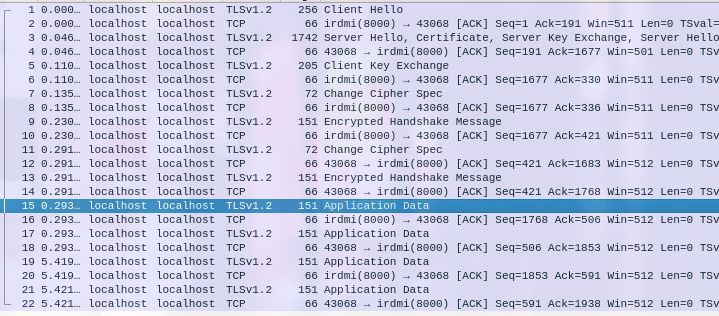
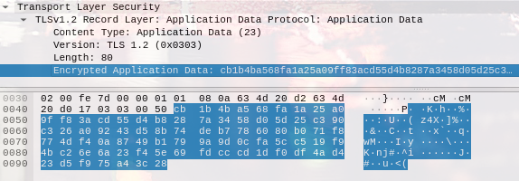
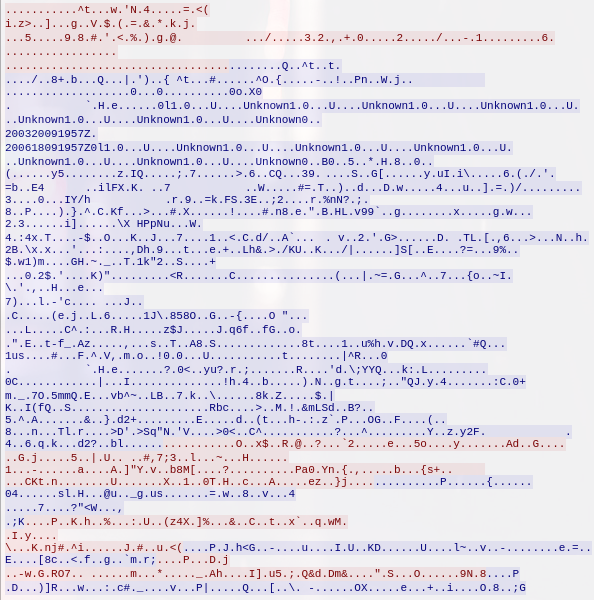
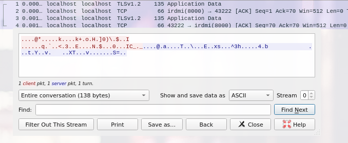

# TLS stuff

using an SSL client-server example by some dude  
run `ssl.sh` and write some stuff to see it in Wireshark

## Proof of encryption:

### With key exchange

  
  


Looks pretty darn unreadable to me.

### Once again

\- with no need for lengthy encryption handshake

In terminal:

```
Enter something:
HELLO HELLO
Server log: HELLO HELLO
Client got back: HELLO HELLO
```

In Wireshark:



Pretty clear that the transmitted data is encrypted.
