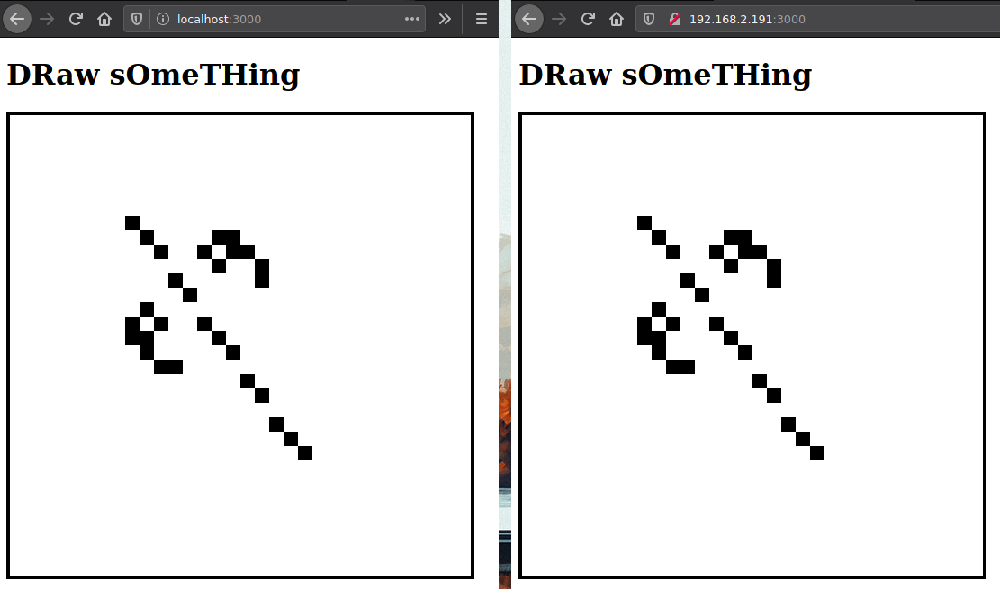

# 07 WebSocket

## The task

Ta utgangspunkt i rfc6455 og programmer et WebSocket-server bibliotek som gjennom socket-programmering (du skal ikke bruke et ferdig WebSocket bibliotek på serversiden):

[x] Utfører handshake med klienter
[x] Leserer korte meldinger fra klienter
[x] Kan sende korte meldinger til tilknyttede klienter
[x] Frivillig: lag et tegnebrett som flere klienter kan tegne på samtidig.

## The result

WebSocket library in `whereissock.js`,  
drawing board server in `server.js`.

