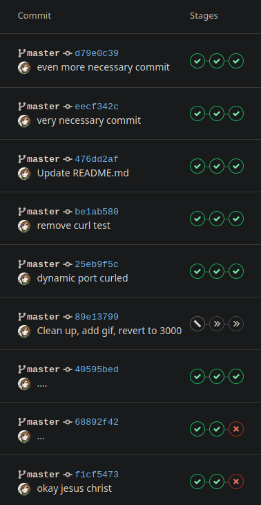

# Contionuous Integration

## magnificent commit log

## SSH setup

The following files are required:
+ Server side:
    + `~/.ssh/authorized_keys` with public key of client (CI pipeline host)
+ Client side (pipeline host):
    + `~/.ssh/id_rsa` - private key of client  
      _must match public key of course_ 
    + `~/.ssh/known_hosts` - output of `ssh-keyscan <server IP>`  
      avoids the usual "do u wanna trust dis host" prompt

## whatever

## systemd setup

To demonstrate restarting a running process, we were tasked with creating a systemd unit and running `systemctl --user restart app` through SSH.

## gitlab being weird

Since I decided to use my own laptop as a server, and since the GitLab instance of our school runs on the internal network, a problem of GitLab sometimes not being able to connect to any ports on my internal IP appeared. This was a significant annoyance.

